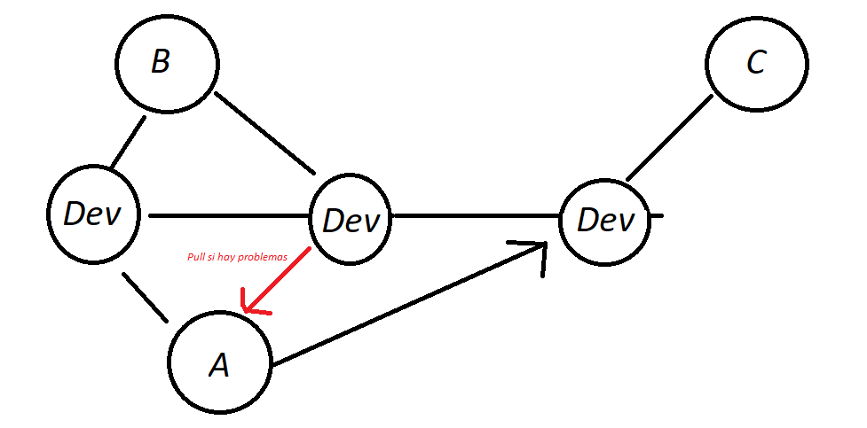
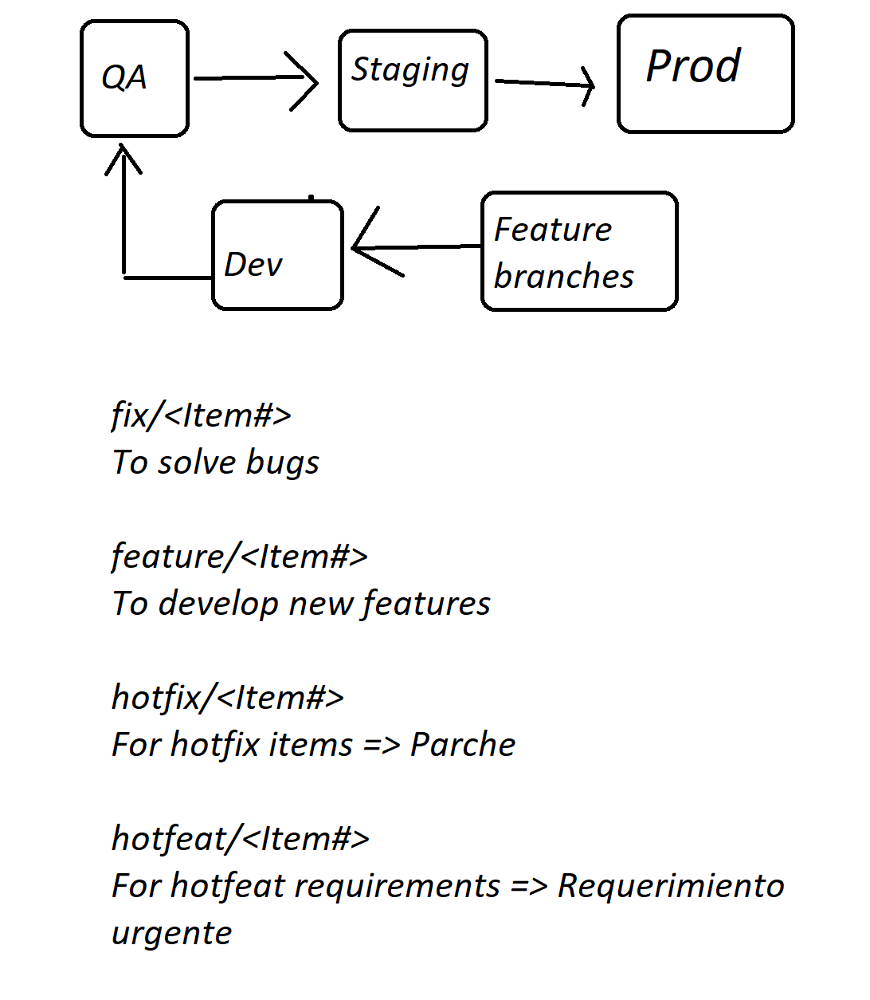

# git-stuff

Para cambiar de ambiente localmente y dar un tracking es con este comando:
```shell
# git checkout <branch-en-servidor> i.e.
cmd> git checkout dev
```

### Requerimiento: 
Se necesita crear un nuevo archivo
Ejemplo: numero de ticket que es provisto por un sistema de gestion de requerimientos

```shell
# git checkout -b <tipo de item>/<item#> i.e.
cmd> git checkout -b feature/12345
```

Para poder subir mis cambios al servidor tengo que crear un pull request
Este pull request va a ser revisado por mi Tech Lead
* Avisa a tu tech lead cuando termines un feature y hayas creado el pull request

```shell
# para salvar tus cambios en tu branch actual
cmd> git add .

# para hacer el commit es con este comando 
cmd> git commit -m "Hoy agregue esta funcion X"

# para ver todos los cambios que he hecho y no están todavía en el server usar este comando
cmd> git log --branches --not --remotes

# para regresar a un punto en específico en la historia vamos ejecutando este comando
cmd> git checkout bbb07785ce9a223d7cccc938582ab34c8ccd42a5 ./README.md

# para regresar todo a como esta en el servidor es con este comando
cmd> git reset --hard

# para revisar los branches de tu entorno local es con este comando
cmd> git branch

# para borrar un branch local es con este comando git branch -D <branchName>
cmd> git branch -D main

# para guardar mis cambios localmente sin hacer ningún commit se usa este comando
cmd> git stash

# para ver la lista de cosas guardadas en mi stash se usa este comando
cmd> git stash list

# para volver a recuperar las cosas del stash basta con este comando
cmd> git stash pop

```



